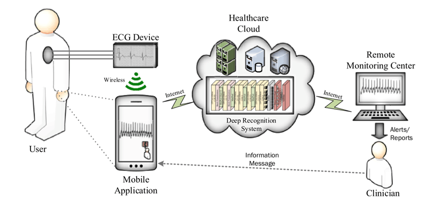

## 基于深度学习的ECG分类(一)——项目介绍

### 摘要

心血管疾病已经称为全球病人的头号杀手，患病死亡率达到全球首位；而且随着生活压力的增大，心血管健康也越来越受到人们的关注。传统的医生问诊的手段存在误诊率高、诊断不及时的弊端，而心血管疾病又有着发病急、宜早治疗的特点，因此有必要设法降低各种心脏病的误诊率，及时发现病情、尽早治疗。

本项目的目的是使用深度学习算法，对人体的心电信号进行分类，判断出被测试者心跳是否正常，或患有某种心脏疾病。整个项目是分为如下几个阶段完成的：

- 研读该领域近几年研究综述，对该领域的进展有一个整体上的认识，进一步精读其中的经典论文，掌握基本方法；

- 调查世界上现有的数据库，重点关注不同数据库的数据标签、采样频率、导联方式等能够影响深度学习模型的信息；
- 根据第一步中的调研，选择合适的数据库，从中选出最终想要分类的标签（根据数量选择），统一不同的数据库的频率，然后合并数据库；
- 对心电信号进行滤波、切割、标准化等预处理；
- 使用深度学习模型对预处理之后的信号进行分类；
- 将模型部署到树莓派。

在深度学习模型方面，我们尝试了卷积神经网络、自编码器、GRU等模型，最终使用卷积神经网络对7种不同的心脏疾病进行分类，到达96%的准确率，比参考论文的准确率提高了2%左右，假阴性率大大降低。同时我们将模型部署到了raspberry zero上，实现了边缘计算。

### 一.研究背景

心电图是诊断心脏性疾病的重要手段，自50年前问世以来，计算机辅助解释在临床ECG工作流程中已变得越来越重要，它在许多临床环境中成为医生解释的重要辅助手段。然而，现有的商业心电图解释算法仍然存在较高的误诊率。传统的机器学习算法需要手工进行滤波、特征提取、小波变换等复杂操作，这些数据操作很大程度上依赖于医疗行业经验，而且对最终的模型结果影响较大。近些年来，人们开始尝试用深度学习来对原始的ECG数据进行分类，且已经取得重大进展。相比较于传统的机器学习，深度学习的卷积神经网络可以自动提取特征，不需要手工提取，避免了因缺乏行业经验而对模型的分类结果造成影响。

### 二.心电信号

一个完整的心跳周期是由P波、QRS波群、T波、U波及间期波形组成，每种心电波形及代表了不同心脏部位的各种电活动，医生在诊断的时候必须对心电波段的形状及其含义有清晰的认识。一个完整的心拍如下：

（1）P波：P波通常认为是整个心电周期的一个开始部分，表示心房肌除极期间的电位发生变化的具体情况。前后分别代表右心房激动、左心房激动，间期长度大约为0.08s-0.11s，幅值不超过0.25mV。

（2）P-R间期：PR间期代表由窦房结产生的兴奋致使心室肌开始兴奋所需要的传导时间，故也称为房室传导时间，间期长度一般为0.12s-0.2.s。

（3）QRS波群：QRS波群是由Q波、R波和S波组成的一个波群组。其中Q波是其第一个时长一般不小于0.04s的向下的波形，Q波后面高尖突起的波就是R波，随后向下的是S波。QRS波群图形所含信息比较丰富，常用这个波形来作判别心律失常类型的主要工具和依据。

（4）T波：T波主要代表心室快速运动复极时的电位波动变化。T波的波形方向一般与QRS波群相同，间期长度大约为0.02s-0.25s。

（5）QT间期：QT间期表示心室肌除极和心室肌复极的运动全过程。间期长度大约为0.43s-0.44s。

（6）U波：U波出现在T波之后0.02s-0.04s，振幅低小。U波方向一般与T波方向相同，振幅大约为T波的一半。

心律失常（arrhythmia）是由于窦房结激动异常或激动产生于窦房结以外，激动的传导缓慢、阻滞或经异常通道传导，即心脏活动的起源和（或）传导障碍导致心脏搏动的频率和（或）节律异常。

### 三.深度学习

深度学习的兴起为心电图的识别提供了一种端到端的解决方案，即不需要手工进行滤波和特征提取，直接将心电数据切分后输入到模型中即可进行分类。此处经典的卷积神经网络起到了特征提取的作用，其中的每一个卷积核相当于一个滤波器，从原始信号中滤出含有信息的信号。

首先我们对该领域引用量较高的一篇论文进行了复现：A deep convolutional neural network model to classify heartbeats（https://www.sciencedirect.com/science/article/pii/S0010482517302810），该论文中只使用了简单的卷积神经网络，达到了94%的准确率。

进一步我们根据前期文献综述中指出：将CNN与LSTM相结合可以提取出信号在空间和时间上的特征，更全面地反映心电信号中包含的信息，也是未来研究的趋势。因此我们也尝试搭建了CNN+LSTM模型及CNN+GRU模型，最终达到了97%的准确率。

### 四.硬件部署

- 树莓派：树莓派是基于Linux的单片机电脑，其处理器为ARM架构，主要使用SD卡或者TF卡作为存储媒体。其最新系统预装了python3.7，支持tensorflow2.0，这为部署提供了极大的便利。使用tensorflow官网提供的边缘设备部署方案，将模型转化为tensorflow lite格式便可轻松完成部署。
- 心电模块：AD8232是一款用于ECG及其他生物电测量应用的集成信号调理模块。该器件设计用于在具有运动或远程电极放置产生的噪声的情况下提取、放大及过滤微弱的生物电信号。该设计使得超低功耗模数转换器(ADC)或嵌入式微控制器能够轻松地采集输出信号。整个模块有三个探头，放在人体的三个部位可以从不同角度反映人体的心电信息。
- AD模块：PCF8591是简单常用的模数转换芯片，心电模块从人体采集到模拟信号之后传给PCF8591，进而转化成数字信号，作为模型的输入。

