# 基于深度学习的ECG分类(三)——基本模型复现：CNN+GRU

## 1. 概要

我们通过用户的ECG (electrocardiogram) 信号来判断用户的心脏状况，一段10s的ECG信号图像如下所示

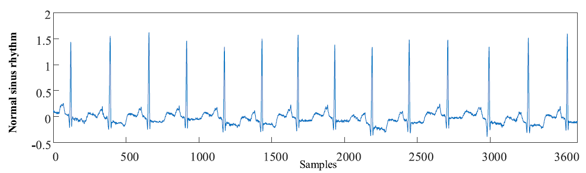

通过观察我们可以得出，这一段ECG信号既包含**空间特征**，又包含**时间特征**，那么如果我们能够将ECG信号两方面的特征都提取利用起来，识别的准确率无疑会大大增加。所以我们分别采用**卷积神经网络**(convolutional neural network, CNN) 和 一种**循环神经网络(**Recurrent Neural Network, RNN)来分别提取ECG信号的时间特征和空间特征并对ECG信号进行分类。

**卷积神经网络**适合处理**空间数据**，一维卷积神经网络也被称为时间延迟神经网络（time delay neural network），可以用来处理一维数据。 CNN的设计思想受到了视觉神经科学的启发，主要由卷积（convolutional layer) 和池化层（pooling layer）组成。卷积层能够保持图像的空间连续性，能将图像的局部特征提取出来，池化层能降低中间隐含层的维度，减少接下来各层的运算量。

**循环神经网络**，适合处理**时序数据**，在语音处理、自然语言处理领域应用广泛。循环单元之间的连接允许信息在相邻的时间步长中循环。这就形成了一种内部的反馈状态，使网络能够理解时间的概念，并了解所呈现数据内的时间动态。但是，原始的循环神经网络存在梯度消失或梯度爆炸问题，所以利用RNN的变种如LSTM、GRU等结构来提取ECG信号的时间特征可以克服长期记忆的短板。

卷积神经网络和循环神经网络在ECG信号上都有比较好的表现，另外，这两个模型都不需要我们再手动地提取任何特征，而且它们相对容易实现。因此，通过合并这两种模型可以构造一种性能更优的对带噪心电信号的进行分类的端到端的神经网络模型。

> 相信大家对CNN都比较了解了，所以后文首先介绍**GRU的结构与运作方式**，然后介绍**一种结合卷积神经网络与循环神经网络**进行心电识别的方法，对CNN不再单独展开介绍。

## 2. GRU

GRU(Gated Recurrent Neural Network，门控循环单元)，与LSTM一样，也是为了解决普通RNN无法进行长程记忆的问题。可以说，GRU是LSTM的一种变体。那么，GRU的结构是什么样的呢？GRU和LSTM相比有哪些不同又有那些共同点呢？下面我就来为大家一一介绍。

### 2.1 LSTM简介

我们要研究鸡蛋，得先去了解母鸡。LSTM就是GRU的母鸡，所以我们先来简单看一下LSTM是个什么东西。

#### 2.1.1 RNN与LSTM

RNN（Recurrent Neural Network）是一种具有大量环路的神经网络，环路的存在使得RNN比普通的前馈神经网络具有更好的记忆功能。但是因为人工神经元在处理信息时存在信号的衰减，RNN的记忆能力仍然不足以应对真实序列中的长程依赖特性。

下图是一个简单的RNN网络结构，红色的部分是同层间的连接。除了同层间的连接以外，RNN和普通的前馈神经网络没有什么不同。

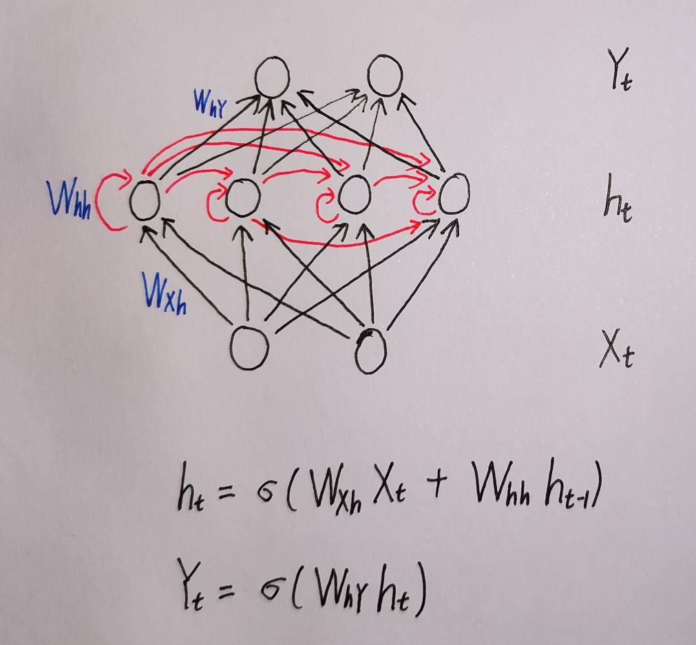

为了解决RNN无法进行长程记忆的问题，尤根·斯提姆哈勃提出了LSTM(Long Short Term Memory，长短时记忆)。

#### 2.1.2 LSTM的结构

这是一个LSTM结构的简单示意图

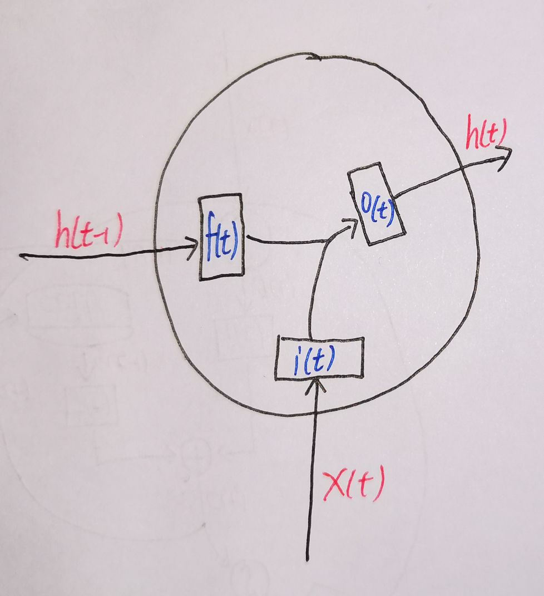

如上图，我们可以把LSTM的结构简要概括为**同外界交流的三要素**以及**对三要素进行控制的三个门**

- ##### 同外界交流的三要素

  - 来自同一时间步上一层神经元的数据**输入**$x(t)$
  - 来自同一层神经元上一时间步的数据**输入**$h(t-1)$
  - LSTM单元对外界的数据**输出**$h(t)$

- ##### 控制三要素的三个门

  - 控制输入$x(t)$的**输入门**$i(t)$
  - 控制输入$h(t-1)$**遗忘门**$f(t)$
  - 控制输出$h(t)$的**输出门**$o(t)$

##### 进一步，一个LSTM单元的运作可以写成如下动力学方程

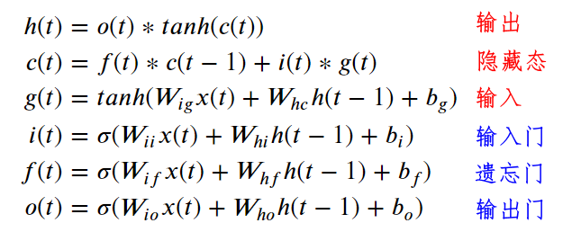

##### 相应的运作过程如下图所示：

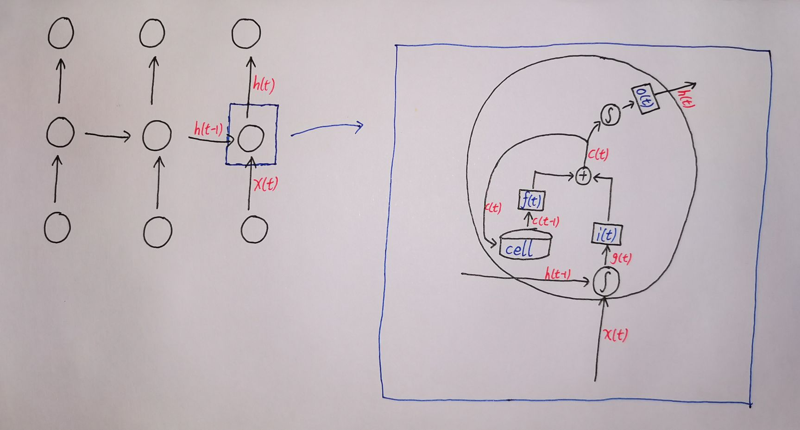

**1** 来自同层上一个时间步的数据$h(t-1)$和来自上一层同一时间步的数据$x(t)$经过一个tanh激活函数得到$g(t)$

**2** $g(t)$经过输入门$i(t)$得到$i(t)*g(t)$

​                                     本单元历史隐藏态$c(t-1)$经过遗忘门$f(t)$得到$f(t)*c(t-1)$

**3** $i(t)*g(t)$和$f(t)*c(t-1)$相加得到$c(t)$

**4** $c(t)$保存为本单元隐藏状态

  $c(t)$经过一个$tanh$激活函数然后再经过输出门$o(t)$得到本单元的输出$h(t)$

### 2.2 GRU的结构

这是一个GRU结构的简单示意图：

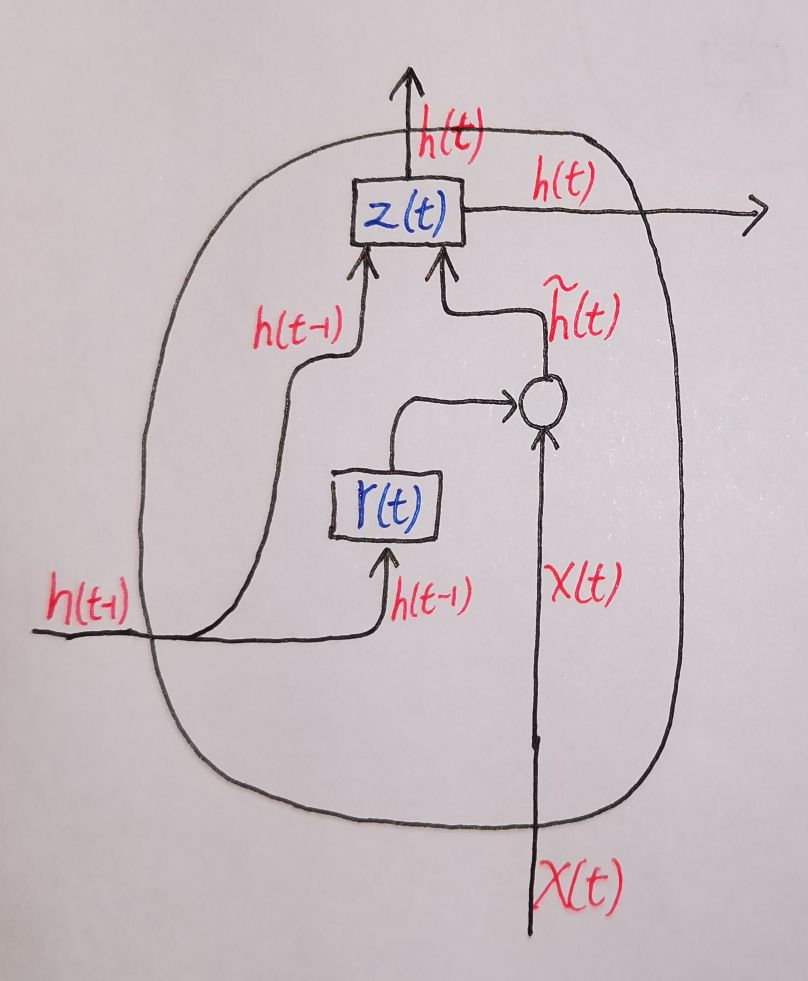

- GRU**同外界交流的三个元素**与LSTM相同
  - 来自同一时间步上一层神经元的数据**输入**$x(t)$
  - 来自同一层神经元上一时间步的数据**输入**$h(t-1)$
  - GRU单元对外界的数据**输出**$h(t)$

相比于LSTM的三个门：输入门$i(t)$、遗忘门$f(t)$、输出门$o(t)$

- GRU仅有**两个门**

  - 对来自上一时间步的$h(t-1)$进行选择性遗忘的**重置门**$r(t)$
    - $\tilde h(t) = tanh(W·[r(t)*h(t-1),x(t)])$
  - 权衡旧数据$h(t-1)$和新数据$\tilde h(t)$的**更新门**$z(t)$
    - $h(t) = (1-z(t))*h(t-1)+z(t)*\tilde h(t)$

- ##### 通俗来讲

  - **重置门** $r(t)$ 的运作：GRU综合**过去的"认识"**$h(t-1)$和**来自上一层神经元的输入**$x(t)$得到了**现在的新“认识”**$\tilde h(t)$
  - **更新门** $z(t)$ 的运作：GRU对**过去的"认识"**$h(t-1)$和**现在的新“认识”**$\tilde h(t)$进行加权，作为输出

##### 一个GRU单元的运作可以写成如下动力学方程

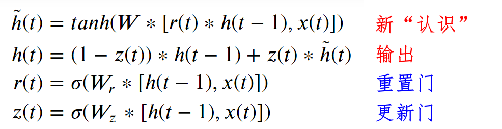

##### 相应的运作过程如下

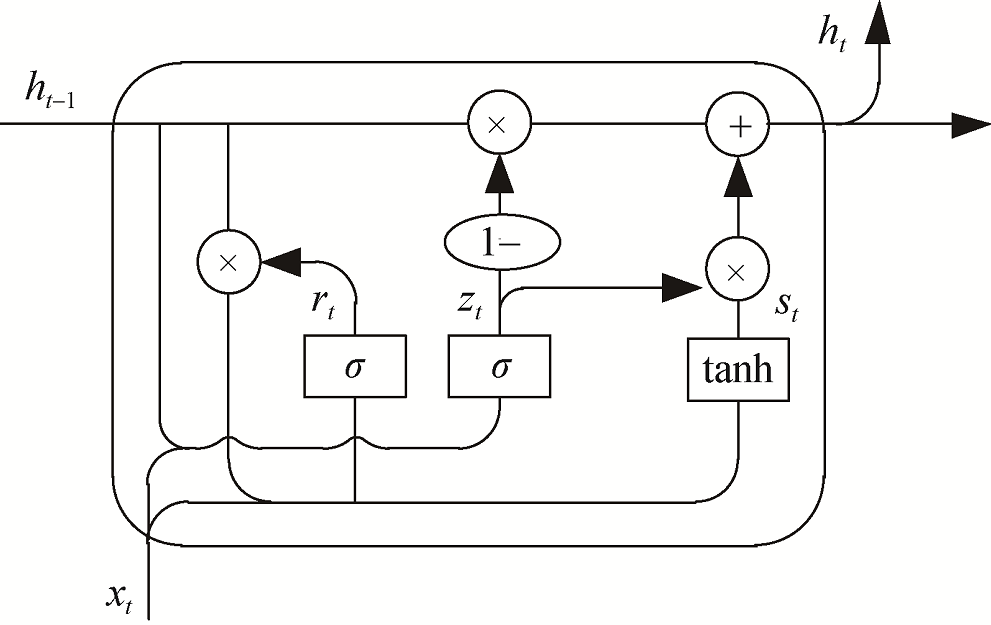


### 2.3 GRU vs LSTM

- ##### 方程

  - 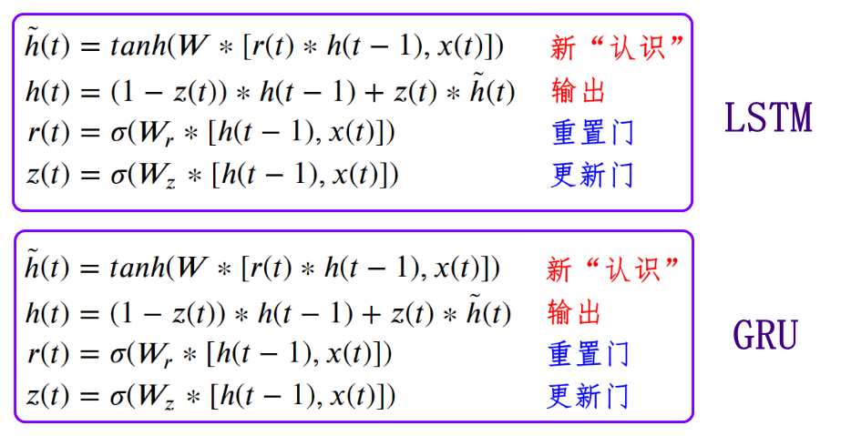

- ##### 运作

  - 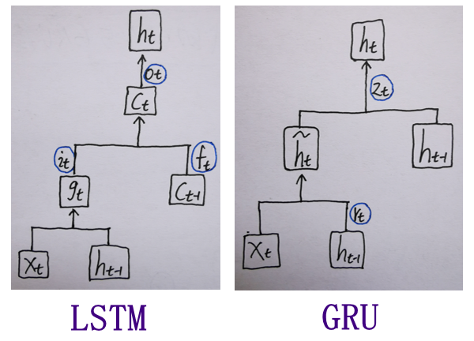

##### 总的来说

- GRU更简单，计算量更小，速度更快，更容易去创建一个大的网络
- LSTM更强大，更灵活

通俗来讲，考虑计算量和表现，GRU与LSTM相比，就好像是两个手的孙悟空(GRU)和六个手的哪吒(LSTM)。

（我们假设哪吒三个头的算力和孙悟空一个头一样，这里的头就好比是我们的电脑或服务器，手就好比是我们的神经网络）


计算量上，哪吒有六个手，比孙悟空多，计算量自然更大。

表现上，则是在某些任务具备优越性，而在另外一些任务表现不出优越性。比如哪吒有了六个手，在搬砖上自然就可以一次搬六个，这里有优越性；但是即便有六个手，只要哪吒的算力和孙悟空是一样的，那么他在解数学题上相对孙悟空便没有多大优越性。

### 2.4 GRU的实现

- ##### return_sequences

  - Boolean. Whether to return the last output in the output sequence, or the full sequence. Default: `False`.

- ##### return_state

  - Boolean. Whether to return the last state in addition to the output. Default: `False`.

```python
# 仅返回最后的隐状态，即（batch_size,units)
inputs = tf.random.normal([32, 10, 8])
gru = tf.keras.layers.GRU(4)
output = gru(inputs)
print(output.shape)
(32, 4)

# 返回所有时刻的隐状态以及最后的隐状态，即（batch_size,time_steps,units）,（batch_size,units)
gru = tf.keras.layers.GRU(4, return_sequences=True, return_state=True)
whole_sequence_output, final_state = gru(inputs)
print(whole_sequence_output.shape)
(32, 10, 4)
print(final_state.shape)
(32, 4)
```

## 3. CNN+LSTM用于心电识别

### 3.1 模型结构

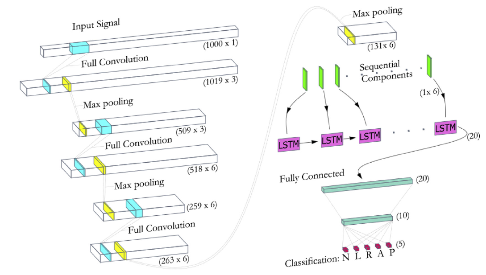

#### 3.1.1 卷积部分

卷积模型由三个步长为1的卷积层组成，在训练过程中，卷积核的权重会被网络不断调整，以获取数据中存在的有意义的空间信息。这里没有采用有效卷积，而是使用了全卷积，这是因为较短的长度段已经被填上了零。此外，为了保留零填充的完整性，在卷积操作过程中不添加偏置，因此，卷积层输出的零填充序列仍将被视为零。我们利用尺寸为2的不重叠步长的最大池化层来使输出的尺寸减半。

#### 3.1.2 循环部分

使用LSTM层从卷积部分输出的特征图中提取时间信息。从卷积和池化过程中提取的特征被分解成连续的成分，并送入循环的LSTM单元进行时间分析。将最后一步LSTM的输出送入全连接层，用于心律失常预测。

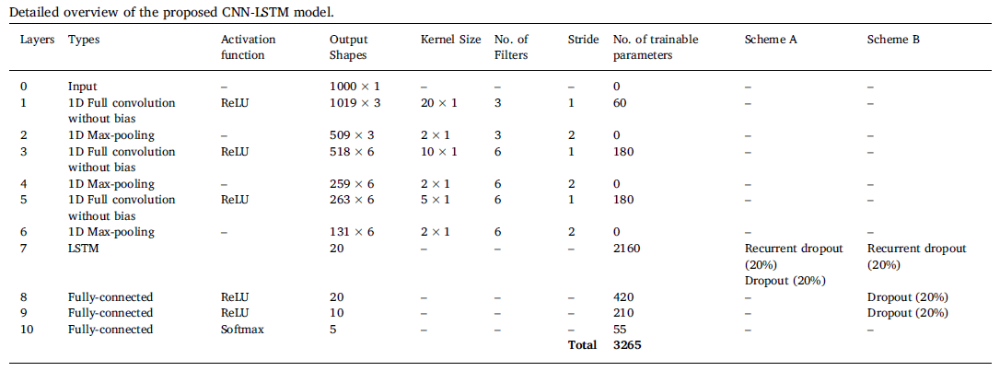

### 3.2 数据描述

论文采用的PhysioNet公共数据集，每一条记录的采样频率都是360HZ。经过对数据的预处理之后，将每条数据的长度都同意变成1000，最后对Normal、LBBB、RBBB、APB、PVC等5个类别的心电数据进行分类。

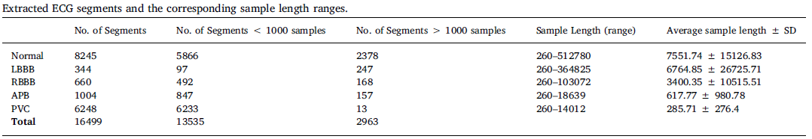

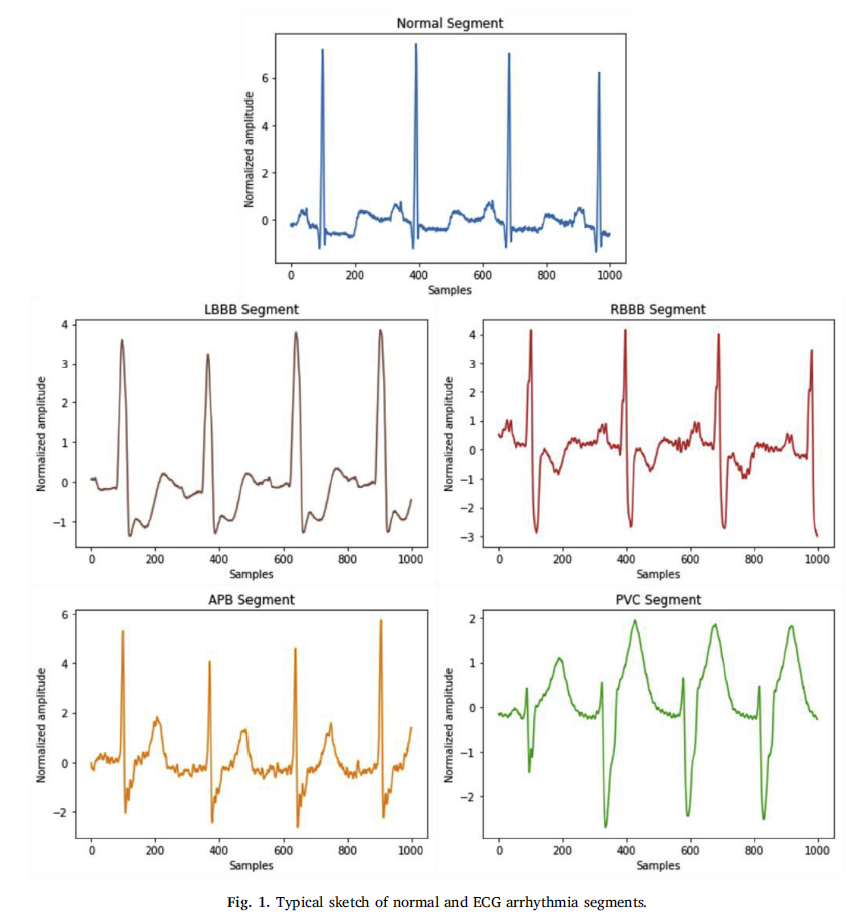

### 3.3 结果

#### 总体分类性能

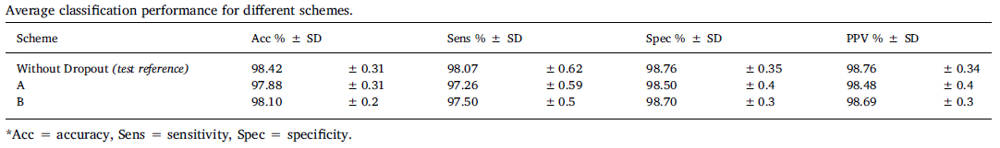

#### 准确率

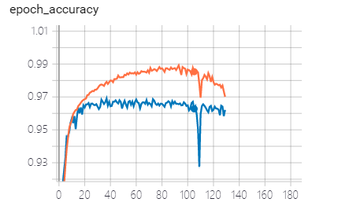

#### 混淆矩阵

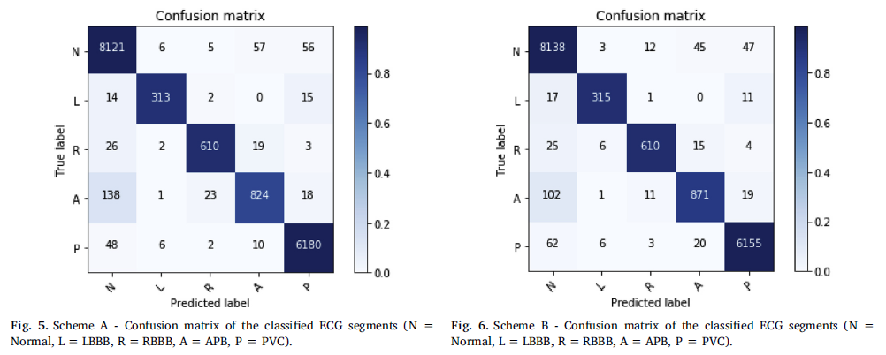

## * 参考

1. Oh, Shu Lih & Ng, Eddie & Tan, Ru San & Acharya, U Rajendra. (2018). Automated diagnosis of arrhythmia using combination of CNN and LSTM techniques with variable length heart beats. Computers in Biology and Medicine. 102. 10.1016/j.compbiomed.2018.06.002. 
2. 《深度学习原理与Pytorch实战》集智俱乐部
3. https://keras.io/api/layers/recurrent_layers/gru/
4. https://blog.csdn.net/qq_29831163/article/details/89929573
5. https://keras.io/api/layers/recurrent_layers/gru/
6. https://zhuanlan.zhihu.com/p/50320401