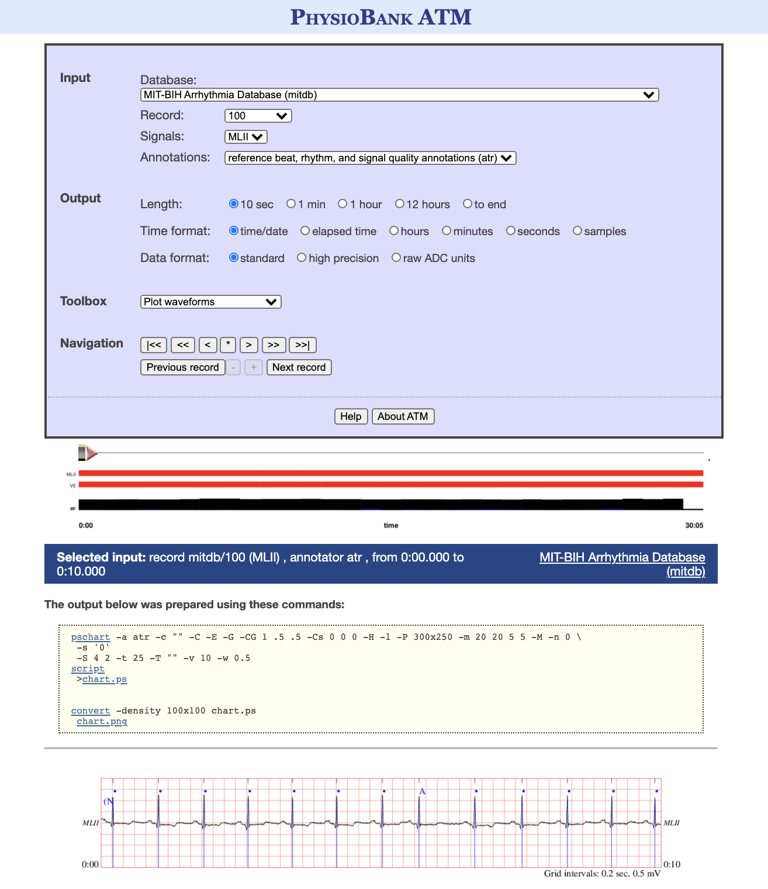
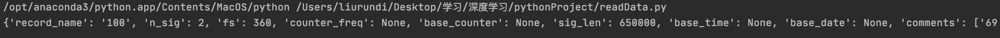
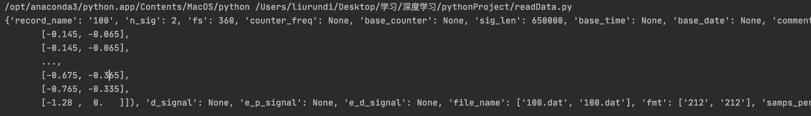
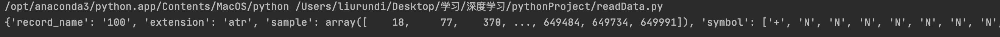
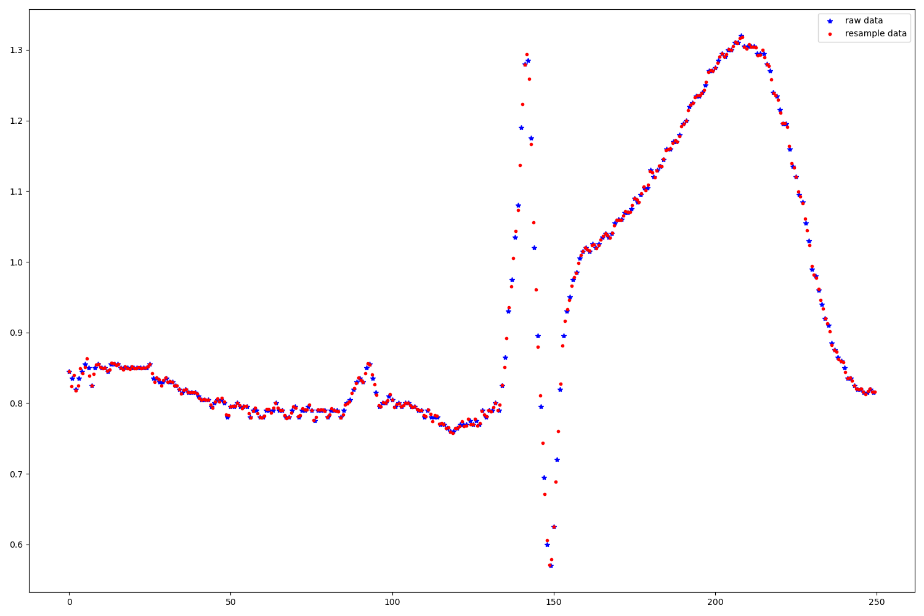
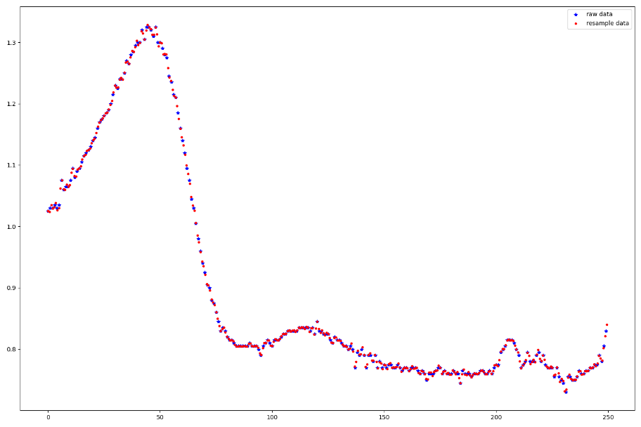

## 1.世界著名心电数据集

目前国际上最重要的且具有权威性的心电数据库有四个：

- MIT-BIH心电数据库：由美国麻省理工学院与Beth Israel医院联合建立；
- AHA心律失常心电数据库：由美国心脏学会建立（**需付费**下载）；
- CSE心电数据库：由欧盟建立（**需付费**下载）；
- 欧盟ST-T心电数据库。

除此之外，国际上被广泛认可的还有Sudden Cardiac DeathHolter Database等心电数据库。

## 2.数据集的选取与下载

### 数据集的选取

在搜索了大量的心电数据库之后，最终选取以下四个数据库进行下载、处理、合并：

1. MIT-BIH心率不齐数据库
2. MIT-BIH ST变化数据库
3. 欧盟ST-T心电数据库
4. 心脏性猝死动态心电数据库

### 数据集的下载

以上四个数据集均可从PhysioNet网站（http://physionet.org/physiobank/database/）上免费下载。

### 对下载到本地的数据集的介绍

- .hea：头文件（可以理解为数据的注释文件），该文件含有记录编号、导联方式、采样频率、采样点数等信息；
- .atr：标记文件，该文件含有人工标注的心拍位置和类型（如：异常心拍类型的字母标记）；
- .dat：心电信号数据（主体）。

## 3.选定数据集的详细介绍

|  数据集名称   |       MIT-BIH Arrhythmia Database        |        MIT-BIH ST Change Database        |          European ST-T Database          |   Sudden Cardiac Death Holter Database   |
| :------: | :--------------------------------------: | :--------------------------------------: | :--------------------------------------: | :--------------------------------------: |
|   采样频率   |                  360Hz                   |                  360Hz                   |                  250Hz                   |                  250Hz                   |
|   导联方式   |             MLII、V1、V2、V4、V5             |                   ECG                    |       MLI、MLIII、V1、V2、V3、V4、V5、D3        |                   ECG                    |
| 每段数据持续时间 |           48条**半小时**两通道动态心电图记录           |                28条不同长度的记录                |         90条**持续时间为两个小时**的动态心电图记录         |    23条持续时间**从7小时到25小时不等**的完整的Holter记录    |
|   标签情况   |               均含有人工标注的心拍注释               |               均含有人工标注的心拍注释               |               均含有人工标注的心拍注释               |         **其中有12条记**录含有人工标注的心拍注释          |
|   储存格式   |                Format 212                |                Format 212                |                Format 212                |                Format 212                |
|   下载链接   | https://physionet.org/content/mitdb/1.0.0/ | https://physionet.org/content/stdb/1.0.0/ | https://physionet.org/content/edb/1.0.0/ | https://physionet.org/content/sddb/1.0.0/ |
|    其他    |                    -                     |            大多数记录是在运动压力测试期间记录的            |                  79位受试者                  | 包括18例潜在的窦性心律（4例间歇性起搏），1例持续起搏和4例房颤。所有患者均患有持续性室性快速性心律失常，并且大多数患者有实际的心脏骤停 |

> 补充说明：导联方式
>
> 常规导联包括：肢体导联和胸壁导联两部分；
>
> - 肢体导联分为三个标准导联（I、II、III）和三个加压单极导联（aVR、aVL、aVF）
> - 胸壁导联共15个（左边V2-V9；右边V1、V3R-V8R）
>
> **导联方式的不同对数据集的合并没有影响**。

## 4.数据集的读取

### 4.1图形化显示

PhysioNet提供了一个简单方便的网页版转换工具PhysioBank ATM（https://archive.physionet.org/cgi-bin/atm/ATM），可以直接从各个数据库提取数据，以折线的方式显示数据的真实变动情况。



### 4.2python读取

**使用WFDB读取数据**

- WFDB是一个用于读取，写入和处理WFDB信号和注释的工具库；
- WFDB 软件包的主要组成是WFDB库，用于信号处理和自动分析的WFDB应用程序，以及用于可视化、注释、波形数据交互式分析的软件WAVE。

#### 安装方法

```
pip install wfdb
```

#### 读取.hea文件

```python
from IPython.display import display
import wfdb
record = wfdb.rdheader('mit-bih-arrhythmia-database-1.0.0/100')
display(record.__dict__)
```



#### 读取record数据

```python
from IPython.display import display
import wfdb
record=wfdb.rdrecord('mit-bih-arrhythmia-database-1.0.0/100', ) 
display(record.__dict__)
```



#### 读取.art文件

```python
import wfdb
annotation=wfdb.rdann('mit-bih-arrhythmia-database-1.0.0/100', 'atr')
display(annotation.__dict__)
```



## 5.数据集的合并

**合并目标**：每条数据为采样频率360Hz的10s数据片段（即每条记录包含3600个数据点），并对应一个标签（节拍注释）值。

### 5.0批量读取数据文件

对数据库中的数据文件进行批量处理

```python
type=[]
rootdir = 'mit-bih-arrhythmia-database-1.0.0'			# 设置根路径	
files = os.listdir(rootdir) #列出文件夹下所有的目录与文件
name_list=[]            # name_list=[100,101,...234]
MLII=[]                 # 用MLII型导联采集的人
type={}                 # 标记及其数量
for file in files:
    if file[0:3] in name_list:   # 根据数据库实际情况调整熟知，这里判断的是每个文件的前三个字符
        continue
    else:
        name_list.append(file[0:3])
for name in name_list:      # 遍历每一个数据文件
    if name[0] not in ['1', '2', '3', '4', '5', '6', '7', '8', '9', '0']:       # 跳过无用的文件
        continue
    record = wfdb.rdrecord(rootdir+'/'+name)  # 读取一条记录（100），不用加扩展名
```

### 5.1对数据长度不一的处理

由于不同数据库的数据长度不一，这里统一裁剪成10s长度的数据。

```python
f=360       # 根据不同的数据库进行更改
segmented_len=10        # 目标：裁剪成10s的数据片段
label_count=0
count=0

segmented_data = []             # 最后数据集中的X
segmented_label = []            # 最后数据集中的Y
print('begin!')
for person in MLII:
    k = 0
    while (k+1)*f*segmented_len<=len(whole_signal[0]):    # 只要不到最后一组数据点
        count+=1
        record = wfdb.rdrecord(rootdir + '/' + person, sampfrom=k * f * segmented_len,sampto=(k + 1) * f * segmented_len)  # 读取一条记录（100），不用加扩展名
        annotation = wfdb.rdann(rootdir + '/' + person, 'atr', sampfrom=k * f * segmented_len,sampto=(k + 1) * f * segmented_len)  # 同时读取一条记录的atr文件，扩展名atr        
```

### 5.2 对导联方式的处理

- 导联方式的不同对数据合并无影响；
- 由于多数数据库提供了多导联方式（多通道）的数据，这里需要任意选取其中一个通道的数据进行后续的处理。

```python
for name in name_list:      # 遍历每一个人
    if 'MLII' in record.sig_name:       # 选取一种导联方式（这里以MLII导联为例）
        MLII.append(name)               # 记录下这个文件
    annotation = wfdb.rdann(rootdir+'/'+name, 'atr')  # 然后读取一条记录的atr文件，扩展名atr
    for symbol in annotation.symbol:            # 同时记录下这个文件对应的标记类型
        if symbol in list(type.keys()):
            type[symbol]+=1
        else:
            type[symbol]=1
    print('sympbol_name',type)
```

```python
for person in MLII:
    k = 0
    whole_signal=wfdb.rdrecord(rootdir + '/' + person).p_signal.transpose()     # 这个人的一整条数据
    while (k+1)*f*segmented_len<=len(whole_signal[0]):    # 只要不到最后一组数据点
        count+=1
        lead_index = record.sig_name.index('MLII')  # 找到MLII导联对应的索引
```

### 5.3对采样频率的处理

使用**重采样**方法将数据集统一到360Hz，这里使用的是**scipy.signal.resample**函数。

```python
for person in MLII:
    k = 0
    whole_signal=wfdb.rdrecord(rootdir + '/' + person).p_signal.transpose()     # 这个人的一整条数据
    while (k+1)*f*segmented_len<=len(whole_signal[0]):    # 只要不到最后一组数据点
        count+=1
        record = wfdb.rdrecord(rootdir + '/' + person, sampfrom=k * f * segmented_len,sampto=(k + 1) * f * segmented_len)  # 读取一条记录（100），不用加扩展名
        annotation = wfdb.rdann(rootdir + '/' + person, 'atr', sampfrom=k * f * segmented_len,sampto=(k + 1) * f * segmented_len)  # 读取一条记录的atr文件，扩展名atr
        lead_index = record.sig_name.index('MLII')  # 找到MLII导联对应的索引
        signal = record.p_signal.transpose()  # 两个导联，转置之后方便画图
        label=[]           # 这一段数据对应的label，最后从这里面选择最终的label
        # segmented_data.append(signal[lead_index])   # 只记录MLII导联的数据段
        symbols=annotation.symbol

        re_signal = scipy.signal.resample(signal[lead_index], 3600)  # 采样
        re_signal_3 = np.round(re_signal, 3) # 对重采样后的数据保留3位小数
        segmented_data.append(re_signal_3) # 将保留3位小数的重采样数据加入x数据集中
```





### 5.4对标签值的处理

这里，我们为数据打标签的标准为：

- 如果数据本身无标签，标记为Q；
- 如果数据标签均为N，标记为N；
- 如果数据标签中含有非N的标签，将其进行记录并统计个数，选取非N标签中出现最多的那个标签对这条数据进行标记。

```python
        if len(symbols) == 0:
            segmented_label.append('Q')
        elif symbols.count('N') / len(symbols) == 1 or symbols.count('N') + symbols.count('/') == len(symbols):  # 如果全是'N'或'/'和'N'的组合，就标记为N
            segmented_label.append('N')
        else:
            for i in symbols:
                if i != 'N':
                    label.append(i)
            segmented_label.append(label[0])
```

### 5.5保存为csv文件

```python
segmented_data=pd.DataFrame(segmented_data)
segmented_label=pd.DataFrame(segmented_label)
segmented_data.to_csv('3X_eu_MLIII.csv', index=False)
segmented_label.to_csv('3Y_eu_MLIII.csv', index=False)
```

> **其他注意事项**
>
> - 空值情况：有的数据库（如Sudden Cardiac Death Holter Database含有nan，在进行数据处理并写入csv时需要将其取出，否则可能会影响模型训练）；
> - 标签不存在的情况：有的数据库中的数据没有对应的心拍标签，我们在进行数据处理时将其标记为Q。