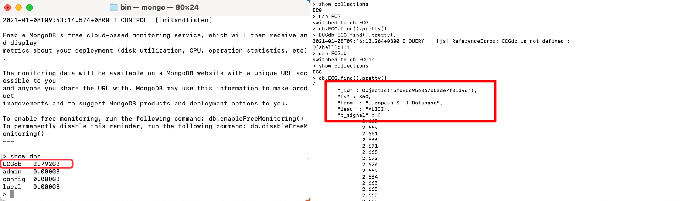
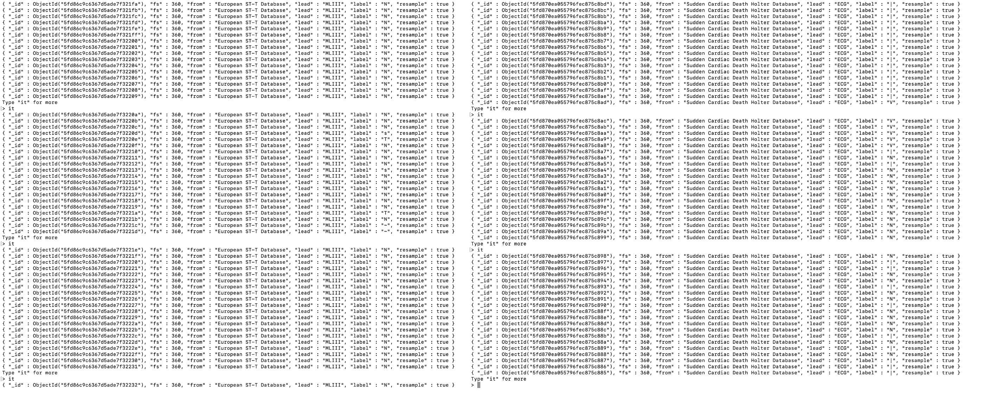

# 基于深度学习的ECG分类(二)——数据集合并及数据预处理

## 1.世界著名心电数据集

目前国际上最重要的且具有权威性的心电数据库有四个：

- MIT-BIH心电数据库：由美国麻省理工学院与Beth Israel医院联合建立；
- AHA心律失常心电数据库：由美国心脏学会建立（**需付费**下载）；
- CSE心电数据库：由欧盟建立（**需付费**下载）；
- 欧盟ST-T心电数据库。

除此之外，国际上被广泛认可的还有Sudden Cardiac DeathHolter Database等心电数据库。

## 2.数据集的选取与下载

### 数据集的选取

在搜索了大量的心电数据库之后，最终选取以下四个数据库进行下载、处理、合并：

1. MIT-BIH心率不齐数据库（https://physionet.org/content/mitdb/1.0.0/）
2. MIT-BIH ST变化数据库（https://physionet.org/content/stdb/1.0.0/）
3. 欧盟ST-T心电数据库（https://physionet.org/content/edb/1.0.0/）
4. 心脏性猝死动态心电数据库（https://physionet.org/content/sddb/1.0.0/）

### 数据文件

- .hea：头文件（可以理解为数据的注释文件），该文件含有记录编号、导联方式、采样频率、采样点数等信息；
- .atr：标记文件，该文件含有人工标注的心拍位置和类型（如：异常心拍类型的字母标记）；
- .dat：心电信号数据（主体）。

## 3.数据集详细介绍

|  数据集名称   | MIT-BIH Arrhythmia Database | MIT-BIH ST Change Database |   European ST-T Database    |   Sudden Cardiac Death Holter Database   |
| :------: | :-------------------------: | :------------------------: | :-------------------------: | :--------------------------------------: |
|   采样频率   |            360Hz            |           360Hz            |            250Hz            |                  250Hz                   |
|   导联方式   |      MLII、V1、V2、V4、V5       |            ECG             | MLI、MLIII、V1、V2、V3、V4、V5、D3 |                   ECG                    |
| 每段数据持续时间 |    48条**半小时**两通道动态心电图记录     |         28条不同长度的记录         |  90条**持续时间为两个小时**的动态心电图记录   |    23条持续时间**从7小时到25小时不等**的完整的Holter记录    |
|   标签情况   |        均含有人工标注的心拍注释         |        均含有人工标注的心拍注释        |        均含有人工标注的心拍注释         |         **其中有12条记**录含有人工标注的心拍注释          |
|   储存格式   |         Format 212          |         Format 212         |         Format 212          |                Format 212                |
|    其他    |              -              |     大多数记录是在运动压力测试期间记录的     |           79位受试者            | 包括18例潜在的窦性心律（4例间歇性起搏），1例持续起搏和4例房颤。所有患者均患有持续性室性快速性心律失常，并且大多数患者有实际的心脏骤停 |

**曾经尝试过的其他数据集**

**PAF Prediction Challenge Database**

数据链接：https://physionet.org/content/afpdb/1.0.0/

+ 一个具有双通道的心电图记录数据库，是the Computers in Cardiology Challenge 2001的挑战赛数据集；
+ 数据集共有**50组记录**，每一组记录包含**双通道**的**持续时间为30分钟**的数据；
+ 但是数据主要关于“心房颤动”疾病。

**MIT-BIH Atrial Fibrillation Database**

+ 数据链接：https://physionet.org/content/afdb/1.0.0/
+ 一个具有双通道的心电图记录数据库；
+ 该数据库共有**25组记录**，是25个长期**心房颤动（主要是阵发性）**人体受试者的心电图记录；
+ 记录以**每秒250**个样本采样，每条记录**持续时间为10小时**；
+ 部分数据**没有心拍注释**。

> 补充说明：导联方式

> 常规导联包括：肢体导联和胸壁导联两部分；
>
> - 肢体导联分为三个标准导联（I、II、III）和三个加压单极导联（aVR、aVL、aVF）
> - 胸壁导联共15个（左边V2-V9；右边V1、V3R-V8R）
>
> **由于浅层的卷积神经网络能够提取信号粗粒度的特征，因此不同的导联方式能通过卷积来分开，合并时不需要人为额外处理。**

## 4.数据集的读取

### 4.1 可视化

PhysioNet提供了一个简单方便的网页版转换工具PhysioBank ATM（https://archive.physionet.org/cgi-bin/atm/ATM），可以直接从各个数据库提取数据，以折线的方式显示数据的真实变动情况。


### 4.2 python读取

#### **使用WFDB读取数据**

- WFDB是一个用于读取，写入和处理WFDB信号和注释的工具库；

- WFDB 软件包的主要组成是WFDB库，用于信号处理和自动分析的WFDB应用程序，以及用于可视化、注释、波形数据交互式分析的软件WAVE。

- 该软件包是用高度可移植的C语言编写的，可以在所有流行的平台上使用，包括GNU/Linux，MacOS/ X，MS-Windows，及Unix的所有版本。

- 功能

  + 对波形和注释进行快速显示 

  - 可以快速访问记录的任意位置，提高效率并减少网络流量 

  - 进行注释模式向前和向后搜索

  - 可以进行图形化的注释编辑，使用标准的或是用户定义的注释方法 

  - 变速叠加显示（如模拟触发式示波器持续性的显示） 
  - 对用户选择的信号片段进行高精度打印

  - 极其灵活的控制外部信号处理和分析程序（菜单可以由用户在WAVE运行时重新配置）

  - 远程模式：外部程序，例如网页浏览器能控制WAVE 的显示 

  - 提供在线帮助

#### 安装方法

+ Github（https://github.com/MIT-LCP/wfdb-python）安装：可以直接下载zip包到本地研读一下源码，了解其数据结构。
+ 直接安装：命令行输入

```
pip install wfdb
```

#### 读取.hea文件

```python
from IPython.display import display
import wfdb
record = wfdb.rdheader('mit-bih-arrhythmia-database-1.0.0/100')
display(record.__dict__)
```


#### 读取record数据

使用**rdrecord**函数，该函数的返回值为一个wfdb中定义的record对象。

```python
def rdrecord(record_name, sampfrom=0, sampto=None, channels=None,
             physical=True, pb_dir=None, m2s=True, smooth_frames=True,
            ignore_skew=False, return_res=64, force_channels=True,
           channel_names=None, warn_empty=False):
```

**常用的重要参数**：

+ record_name : 储存心电信号的路径;
+ sampfrom : 起始位置；
+ sampto : 终止位置；
+ channels :optional，选择读取某个通道的数据，默认读取全部通道；

> 举例

```python
from IPython.display import display
import wfdb
record=wfdb.rdrecord('mit-bih-arrhythmia-database-1.0.0/100', ) 
display(record.__dict__)
```


> **几个经常使用的属性值**

+ fs：采样频率；
+ n_sig：信号通道数；
+ sig_len：信号长度；
+ p_signal：模拟信号值，储存形式为ndarray或者是list；
+ d_signal：数字信号值，储存形式为ndarray或者是list。

> 这些属性都能直接进行访问（如：使用**record.fs**可以直接读取到采样频率)。

#### 读取.art文件

```python
import wfdb
annotation=wfdb.rdann('mit-bih-arrhythmia-database-1.0.0/100', 'atr')
display(annotation.__dict__)
```


其中的**symbol**为心拍注释（包括了正常类型N和各种异常类型）

> 常见注释举例

| Symbol |            Description            |
| :----: | :-------------------------------: |
|   N    |              Normal               |
|   L    |   Left bundle branch block beat   |
|   R    |  Right bundle branch block beat   |
|   V    | Premature ventricular contraction |
|   A    |   Atrial premature contraction    |
|   I    |    Isolated QRS-like artifact     |
|   B    | Left or right bundle branch block |

## 5.数据集的合并

**合并目标**：每条数据为采样频率360Hz的10s数据片段（即每条记录包含3600个数据点），并对应一个标签（节拍注释）值。

### 5.0 批量读取数据文件

对数据库中的数据文件进行批量处理

```python
type=[]
rootdir = 'mit-bih-arrhythmia-database-1.0.0'			# 设置根路径	
files = os.listdir(rootdir) #列出文件夹下所有的目录与文件
name_list=[]            # name_list=[100,101,...234]
MLII=[]                 # 用MLII型导联采集的人
type={}                 # 标记及其数量
for file in files:
    if file[0:3] in name_list:   # 根据数据库实际情况调整熟知，这里判断的是每个文件的前三个字符
        continue
    else:
        name_list.append(file[0:3])
for name in name_list:      # 遍历每一个数据文件
    if name[0] not in ['1', '2', '3', '4', '5', '6', '7', '8', '9', '0']:       # 跳过无用的文件
        continue
    record = wfdb.rdrecord(rootdir+'/'+name)  # 读取一条记录（100），不用加扩展名
```

### 5.1 对长度不一的数据处理

+ 由于不同数据库的数据长度不一，若要进行数据合并，需要将这些记录裁剪成统一长度，这里统一裁剪成**10s**长度的数据；
+ 在rdrecord函数中，通过设置参数**sampfrom&sampfrom**可以直接读取出相应长度的数据，便于进行后续处理。

```python
f=360       # 根据不同的数据库进行更改
segmented_len=10        # 目标：裁剪成10s的数据片段
label_count=0
count=0

segmented_data = []             # 最后数据集中的X
segmented_label = []            # 最后数据集中的Y
print('begin!')
for person in MLII:
    k = 0
    while (k+1)*f*segmented_len<=len(whole_signal[0]):    # 只要不到最后一组数据点
        count+=1
        record = wfdb.rdrecord(rootdir + '/' + person, sampfrom=k * f * segmented_len,sampto=(k + 1) * f * segmented_len)  # 读取一条记录（100），不用加扩展名
        annotation = wfdb.rdann(rootdir + '/' + person, 'atr', sampfrom=k * f * segmented_len,sampto=(k + 1) * f * segmented_len)  # 同时读取一条记录的atr文件，扩展名atr        
```

### 5.2 对导联方式的处理

- **导联方式的不同对数据合并无影响**；
- 由于多数数据库提供了多导联方式（多通道）的数据，这里需要任意选取其中一个通道的数据进行后续的处理。

```python
for name in name_list:      # 遍历每一个人
    if 'MLII' in record.sig_name:       # 选取一种导联方式（这里以MLII导联为例）
        MLII.append(name)               # 记录下这个文件
    annotation = wfdb.rdann(rootdir+'/'+name, 'atr')  # 然后读取一条记录的atr文件，扩展名atr
    for symbol in annotation.symbol:            # 同时记录下这个文件对应的标记类型
        if symbol in list(type.keys()):
            type[symbol]+=1
        else:
            type[symbol]=1
    print('sympbol_name',type)
```

```python
for person in MLII:
    k = 0
    whole_signal=wfdb.rdrecord(rootdir + '/' + person).p_signal.transpose()     # 这个人的一整条数据
    while (k+1)*f*segmented_len<=len(whole_signal[0]):    # 只要不到最后一组数据点
        count+=1
        lead_index = record.sig_name.index('MLII')  # 找到MLII导联对应的索引
```

### 5.3 对采样频率的处理

使用**重采样**方法将数据集统一到360Hz，这里使用的是**scipy.signal.resample**函数。

```python
scipy.signal.resample(x, num, t=None, axis=0, window=None)
```

+ 使用傅里叶方法沿给定轴重新采样 x 到 num 样本;
+ 重新采样的信号起始值与 x 相同，但采样的间距为 len(x) / num （x的间距为x）;
+ 由于使用了傅里叶法，因此假定信号是周期性的。

**常用参数**

+ x：array_like，重新采样的数据；
+ num：int，重新采样信号中的样本数量；
+ Window：数组类、可调用、字符串、浮点数或元组，可选指定应用于傅里叶域中信号的窗口。

```python
for person in MLII:
    k = 0
    whole_signal=wfdb.rdrecord(rootdir + '/' + person).p_signal.transpose()     # 这个人的一整条数据
    while (k+1)*f*segmented_len<=len(whole_signal[0]):    # 只要不到最后一组数据点
        count+=1
        record = wfdb.rdrecord(rootdir + '/' + person, sampfrom=k * f * segmented_len,sampto=(k + 1) * f * segmented_len)  # 读取一条记录（100），不用加扩展名
        annotation = wfdb.rdann(rootdir + '/' + person, 'atr', sampfrom=k * f * segmented_len,sampto=(k + 1) * f * segmented_len)  # 读取一条记录的atr文件，扩展名atr
        lead_index = record.sig_name.index('MLII')  # 找到MLII导联对应的索引
        signal = record.p_signal.transpose()  # 两个导联，转置之后方便画图
        label=[]           # 这一段数据对应的label，最后从这里面选择最终的label
        # segmented_data.append(signal[lead_index])   # 只记录MLII导联的数据段
        symbols=annotation.symbol

        re_signal = scipy.signal.resample(signal[lead_index], 3600)  # 采样
        re_signal_3 = np.round(re_signal, 3) # 对重采样后的数据保留3位小数
        segmented_data.append(re_signal_3) # 将保留3位小数的重采样数据加入x数据集中
```


### 5.4 对标签值的处理

这里，我们为数据**打标签的标准**为：

- 如果数据本身无标签，标记为Q；
- 如果数据标签均为N，标记为N；
- 如果数据标签中含有非N的标签，将其进行记录并统计个数，选取非N标签中出现最多的那个标签对这条数据进行标记。

```python
if len(symbols) == 0:
    segmented_label.append('Q')
    elif symbols.count('N') / len(symbols) == 1 or symbols.count('N') + symbols.count('/') == len(symbols):  # 如果全是'N'或'/'和'N'的组合，就标记为N
        segmented_label.append('N')
        else:
            for i in symbols:
                if i != 'N':
                    label.append(i)
                    segmented_label.append(label[0])
```

> **其他注意事项**
>
> - 空值情况：有的数据库（如Sudden Cardiac Death Holter Database含有nan，在进行数据处理并写入csv时需要将其取出，否则可能会影响模型训练）；
> - 标签不存在的情况：有的数据库中的数据没有对应的心拍标签，我们在进行数据处理时将其标记为Q。

## 6.数据的存储

### 6.1 存储为csv文件

使用上部分的代码处理完成后，可以通过使用下面的代码将数据存储为csv格式。

其中，数据片段存储为 x文件，相应的标签纸存储为 y文件。

```python
segmented_data=pd.DataFrame(segmented_data)
segmented_label=pd.DataFrame(segmented_label)
segmented_data.to_csv('3X_eu_MLIII.csv', index=False)
segmented_label.to_csv('3Y_eu_MLIII.csv', index=False)
```

### 6.2 存储进MongoDB

#### 连接本地MongoDB

```python
from pymongo import MongoClient
import csv

# 创建连接MongoDB数据库函数
def connection():
    # 1:连接本地MongoDB数据库服务
    conn=MongoClient("localhost")
    # 2:连接本地数据库这里是ECGdb)，没有时会自动创建
    db=conn.ECGdb
    # 3:创建集合（ECG）
    set1=db.ECG
    return set1
```

#### 将csv文件的数据以特定形式存储进MongoDB

目标存储形式：

```python
								'fs':360,                                  #采样频率
                'from':'MIT-BIH arrhythmia Database',      #该数据来自哪一个数据库
                'lead':'MLII',                             #导联方式
                'p_signal':array_x,                        #数据点
                'label':array_y[counts],                   #标签值
                'resample':False                           #是否已经经过了重采样
```

按照上面的目标存储形式将处理好的csv数据文件存储进入MongoDB中：

```python
def insertToMongoDB(set1):
    with open(' ', 'r', encoding='utf-8')as csvfile:
        # 调用csv中的DictReader函数直接获取数据为字典形式
        reader = csv.DictReader(csvfile)
        array_y=[]
        for label in reader:
            for i in label:
                array_y.append(label[i])

    with open(' ', 'r', encoding='utf-8')as csvfile:
        # 调用csv中的DictReader函数直接获取数据为字典形式
        reader = csv.DictReader(csvfile)
        # 创建一个counts计数一下 看自己一共添加了了多少条数据
        counts = 0
        for each in reader:
            array_x = []
            for k in each:
                array_x.append(float(each[k]))
            data = {
                'fs':360,
                'from':'MIT-BIH arrhythmia Database',
                'lead':'MLII',
                'p_signal':array_x,
                'label':array_y[counts],
                'resample':False
            }
            print(counts)
            print(array_x)
            print(array_y[counts])

            counts += 1
            set1.insert(data)
            print('成功添加了' + str(counts) + '条数据 ')
```

#### 调用主函数

```python
# 创建主函数
def main():
    set1=connection()
    insertToMongoDB(set1)
# 判断是不是调用的main函数。这样以后调用的时候就可以防止不会多次调用 或者函数调用错误
if __name__=='__main__':
    main()
```

#### MongoDB中的存储形式

+ 创建相应的数据库（ECGdb）和集合（ECG）
+ 数据存储形式（如右图）



+ 每条数据的详细信息（由于p_signal数据量很大，所以为了清晰的展示数据条数，将p_signal隐藏）

