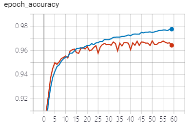

## 基于深度学习的ECG分类(四)——模型改进：SE-Net

### 1.设计思路

#### 1.1 回顾

前期我们主要对现有的论文进行复现与简单的改进，已经搭建好的CNN-GRU模型达到了98%的准确率。**进一步，我们想根据自己对于问题的理解，搭建自己的深度学习模型。**

首先回归到神经网络的本质，卷积神经网络的作用就是提取信号在空间上的特征，循环神经网络的作用是提取信号在时间上的特征。而我们之所以在CNN后面堆叠了GRU循环神经网络，是考虑到心电数据本身是时间序列，判断某一类心率不齐的关键点就在于QRS波段。由于这一波段在整个周期当中所占的比例是比较小的，这就类似于在语言模型中，接下来将会出现的词与之前出现已经出现的文字是密切相关的。

#### 1.2 遇到的问题

但是我们在训练神经网络的时候出现一个问题：随着CNN层网络层数的加深，最终分类的效果不增反降，甚至在训练集上的准确率也停滞不前。这时候我们考虑到ResNet的诞生背景：训练集上准确率下降不是由于过拟合造成的，而是加入了某些不该有的层。ResNet通过identity mapping，通过网络的训练，把不该有的层用identity代替，解决了上述问题。我们考虑：对于心电数据，某个患者的心率问题最直接的是由一个周期当中的某一波段起关键作用，其他波段虽然有影响，但作用较小。从图像上来看，基本从R波段就能判断一个人的心脏是否有问题；P,Q,S段虽然也能体现，但已经不是决定性因素。**因此我们就想设计一种网络结构，如何能做到放大某一部分的特征，而忽略一些不相关的特征，充分利用现有的卷积层而不再增加网络的深度。**

> **后来通过查阅论文，发现早已有人提出了一种称为SE-Net的网络结构，就能实现上述设想。首先我们对SE-Net的原理进行介绍，然后再来看如何能把它应用到我们自己的模型上。**

### 2.什么是SE-Net

#### 2.1 整体结构

**SE-Net全称Squeeze-and-Excitation Networks，它基于这样的基本思想：所见即重要。**先前的大部分研究都是基于空间上的特征，而SE-Net则是从通道的角度来考虑，由于不同的卷积核刻画了信号的不同方面的特征，有些特征是重要的，而有些特征可以忽略，如何计算一个通道维度上的权重来对通道进行加权处理成为了SE-Net的核心。


上图是SE-Net论文中的原图，其中$F_{tr}$是传统的卷积结构，$X$和$U$分别是$F_{tr}$的输入（$C'\times H'\times W'$）和输出（$C\times H\times W$），这些与普通的卷积神经网络并无差别。SE-Net作出改进的部分是卷积结束后的部分，这一部分便是计算一个通道维度上的权重来对通道进行加权处理：首先对$U$先做一个Global Average Pooling（图中的$Fsq(.)$，即Squeeze过程），输出的$1\times1\times C$的数据再经过两个全连接层（图中的$Fex(.)$，即Excitation过程），最后用sigmoid（论文中的self-gating mechanism）限制到$[0,1]$的范围，这就是我们前面所说的通道维上的权重。把这个权重（称为scale）乘到刚刚卷积得到的$U$的$C$个通道上，作为下一层的输入。

#### 2.1 实现细节

**Squeeze 模块**

由于卷积只是在一个局部空间内进行操作，$U$很难获得足够的信息来提取channel之间的关系。为了，SENet提出Squeeze操作，将一个channel上整个空间特征编码为一个全局特征，采用global average pooling来实现。其实也可以采用更复杂的策略，最终目的都是为了获得一个全局特征，SE-Net的提出者考虑的是网络可能不只是用于分类任务、可能也会用于目标检测等，这种情况下整体的信息更为关键，因此$F_{sq}(\cdot)$采用了求平均值的策略：
$$
z_{c}=F_{s q}\left(u_{c}\right)=\frac{1}{H \times W} \sum_{i=1}^{H} \sum_{j=1}^{W} u_{c}(i, j), z \in R^{C}
$$
公式中的$u_c(i,j)$就是卷积之后得到的矩阵$U$的第$i$行，第$j$列的元素，把一整个矩阵所有的元素相加取平均就得到$z_c$。

**Excitation 模块**

经过Sequeeze操作后我们得到了能够描述全局的特征，接下来我们需要考虑如何获取channel之间的关系，把上面的特征融合起来。这个操作需要满足两个准则：首先要灵活，它要可以学习到各个channel之间的非线性关系；第二点是学习的关系不是互斥的，因为这里允许多channel特征，而不是one-hot形式。因此，SE-Net的提出者考虑使用一个全连接层来学习各个channel之间的关系，也就是得到每个channel的权重：
$$
s=F_{e x}(z, W)=\sigma(g(z, W))=\sigma\left(W_{2} \operatorname{Re} L U\left(W_{1} z\right)\right)
$$
 其中$W_1 \in R^{\frac{C}{r}\times C},W_2 \in R^{C \times \frac{C}{r}}$。Excitation的作用相当于是第一个全连接层起到降维的作用，降维系数$r$是个超参数，使用ReLU激活后通过下一个全连接层恢复原始的维度。

最后将学习到的各个channel的权重（$s\in [0,1]$）乘以$U$上的原始特征： 
$$
\tilde{x} c=F \operatorname{scale}\left(u_{c}, s_{c}\right)=s_{c} \cdot u_{c}
$$
就得到最终的一个SE模块的输出。

> 其实整个操作可以看成学习到了各个channel的权重系数，从而使得模型对各个channel的特征更有辨别能力，重视那些重要的特征而轻视那些不重要的特征。这应该也算一种attention机制。

### 3.如何将SE-Net应用到ECG数据中

理解了SE-Net是如何工作的，将其应用到ECG数据当中就比较容易了。

单个SE模块的代码如下：

```python
def SEBlock(inputs, reduction=16, if_train=True):
    x = tf.keras.layers.GlobalAveragePooling1D()(inputs)   # Squeeze操作
    x = tf.keras.layers.Dense(int(x.shape[-1]) // reduction, use_bias=False,activation=tf.keras.activations.relu, trainable=if_train)(x)		# 降维
    x = tf.keras.layers.Dense(int(inputs.shape[-1]),use_bias=False,activation=tf.keras.activations.hard_sigmoid, trainable=if_train)(x)			# 恢复维度
    return tf.keras.layers.Multiply()([inputs, x])
```

将其整合到CNN-LSTM中整体代码如下：

```python
import tensorflow as tf
def SENet_LSTM(ecg_input):
    x=tf.keras.layers.Conv1D(filters=128, kernel_size=20, strides=3, padding='same',activation=tf.nn.relu)(ecg_input)
    x=tf.keras.layers.BatchNormalization()(x)
    x=tf.keras.layers.MaxPool1D(pool_size=2, strides=3)(x)
    x=tf.keras.layers.Conv1D(filters=32, kernel_size=7, strides=1, padding='same', activation=tf.nn.relu)(x)
    x=SEBlock(x)
    x=tf.keras.layers.BatchNormalization()(x)
    x=tf.keras.layers.MaxPool1D(pool_size=2, strides=2)(x)
    x=tf.keras.layers.Conv1D(filters=32, kernel_size=10, strides=1, padding='same', activation=tf.nn.relu)(x)
    x = SEBlock(x)
    # tf.keras.layers.Conv1D(filters=128, kernel_size=5, strides=2, padding='same', activation=tf.nn.relu),
    x=tf.keras.layers.MaxPool1D(pool_size=2, strides=2)(x)
    # tf.keras.layers.Conv1D(filters=512, kernel_size=5, strides=1, padding='same', activation=tf.nn.relu),
    # tf.keras.layers.Conv1D(filters=128, kernel_size=3, strides=1, padding='same', activation=tf.nn.relu),
    x=tf.keras.layers.LSTM(10)(x)
    x=tf.keras.layers.Flatten()(x)
    # tf.keras.layers.Dense(units=512, activation=tf.nn.relu),
    x=tf.keras.layers.Dropout(rate=0.1)(x)
    x=tf.keras.layers.Dense(units=20, activation=tf.nn.relu)(x)
    x=tf.keras.layers.Dense(units=10, activation=tf.nn.relu)(x)
    output=tf.keras.layers.Dense(units=7, activation=tf.nn.softmax)(x)
    return output

def SEBlock(inputs, reduction=16, if_train=True):
    x = tf.keras.layers.GlobalAveragePooling1D()(inputs)
    x = tf.keras.layers.Dense(int(x.shape[-1]) // reduction, use_bias=False, activation=tf.keras.activations.relu, trainable=if_train)(x)
    x = tf.keras.layers.Dense(int(inputs.shape[-1]), use_bias=False, activation=tf.keras.activations.hard_sigmoid, trainable=if_train)(x)
    return tf.keras.layers.Multiply()([inputs, x])
```

最终准确率曲线如下：



损失曲线如下：

